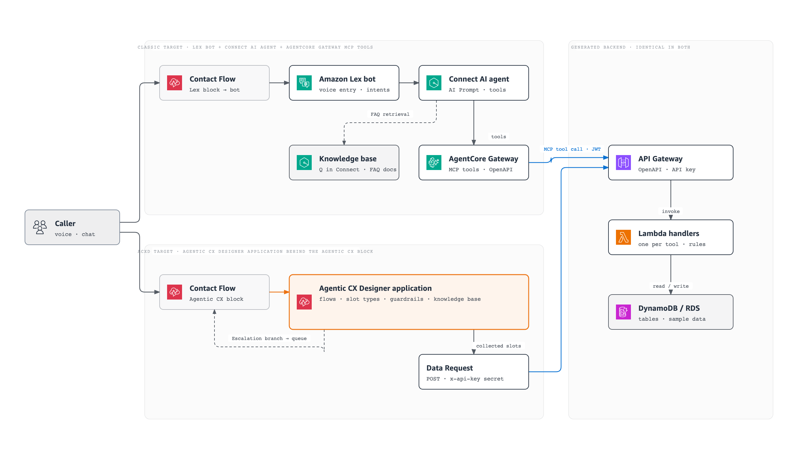

# ACXD packaging and deployment

ACXD is a runtime target of the Classic Full pipeline. A single download is produced by `tools.asset_packager`: Classic backend assets remain in their normal locations, while ACXD assets are added under `assets/acxd/`. The package omits `prompts/ai_agent_prompt.yaml` for the ACXD target.



The diagram's source is `docs/images/acxd-vs-classic-architecture.html` (a self-contained page in the AWS diagram design system; the PNG is a render of its `<svg>`).

## Archive contract

An ACXD archive contains `deploy-manifest.json`, `runner.js`, `package.json`, `lib/*.js`, `WIRING-GUIDE.md`, and these generated resources:

- `assets/acxd/flows/*.json`, `slot-types/*.json`, `data-requests/*.json`, `guardrails/*.json`, `knowledge-bases/*.json`, and `secrets/*.json`
- `assets/acxd/application.json` and `assets/acxd/context-variables.json`
- the Classic `contact-flow/contact_flow.json`, CloudFormation, Lambda, and OpenAPI assets

The packager runs D9 before archive creation. Any D9 error, manifest-schema failure, coverage gap, or missing manifest-referenced backend file rejects packaging. Secret values are never written to the archive; secret declarations name an environment variable that the runner reads at deploy time.

## Runtime contract the generators target

Every item below was verified over live Connect chat in a Connect Customer
account (2026-09-13). They are properties of the ACXD **runtime**, not of the
SDK types or the JSON schemas — a build succeeds either way, so a green build is
no evidence. Full record: [acxd-live-validation.md](./acxd-live-validation.md).

**Intent routing is deterministic, not generative.** `WelcomeFlow` is a greeting
message, then a `user_input` node, then `redirect` to
`{System.capturedFlow:NLX.System}`; when nothing is recognised it redirects to
`FallbackFlow`. No `generative_journey` participates in routing. An operation
flow is a routing target only when it is `untrained: false` **and** carries an
ASCII `aiDescription` ("Use this flow when the user…"); the system flows
(`Welcome`, `Fallback`, `FollowUp`) are `untrained: true` and are never targets.

**Continuity is a flow, not a prompt.** An operation that succeeds redirects to
`FollowUpFlow`, which asks "anything else?" as a `user_choice` over the `yesNo`
slot type: yes → greeting + `user_input` → redirect to the recognised flow, no →
thanks + `end`, no match → `FallbackFlow`. `FallbackFlow` increments a context
variable and escalates on the third attempt.

**A default-behaviour flow is not routable.** `EscalationFlow` cannot be reached
by intent, so the bundle ships a routable `RequestAgentFlow` that redirects into
it. The `escalate` node must be **terminal** — an `escalate` followed by `end`
made Connect report Success instead of taking the Escalation branch. `end` means
"exit the application", which Connect also sees as Success.

**Slot types come from a fixed vocabulary.** An attached slot's `type` is either
a custom slot-type id or an NLX built-in (`NLX.Text`, `Number`, `Date`, `Time`,
`Email`, `Name`, `PhoneNumber`, `Url`, `Ordinal`, `AlphaNumeric`, `Duration`).
The literals `text`, `number` and `boolean` are accepted on save and silently
disable flow recognition for the **whole application**. There is no boolean
built-in, so yes/no is a custom slot type with synonyms. A custom slot type with
a single sample value is a one-item menu the runtime auto-selects without
asking, so open-ended values belong on a built-in plus an `AttachedSlot.regex`.

**Retry clears the slot.** A no-match recovery message must carry a
`stateModifications` slot clear before returning to the same capture node;
without it the same turn falls through to `FallbackFlow`, and a second capture
node for the same slot no-matches immediately. Slot values persist for the
session, so a flow clears its slots when it EXITS (on the redirect or escalate
that leaves it) — never at an operation flow's start, which would erase a value
already filled from the routing utterance.

**Data requests: payload, environments, secret header.** A `data_request` node
needs an explicit `dataRequests[].payload` mapping
(`{field: '{slot:NLX.Slot}' | '{ctx:NLX.Context}'}`) or the webhook receives no
fields, and its outgoing edges use `node_status` ∈ `success` / `failure` /
`timeout` (`error` is invalid and lands in the fallback). The webhook itself
carries the API key as `{"key": "x-api-key", "value": "{BackendApiKey:NLX.Secret}",
"sensitive": true}` — `{{secrets.BackendApiKey}}` is sent verbatim and the API
Gateway answers 403 — and the same URL and headers are repeated under
`webhook.environments.production` and `webhook.environments.development`, which
is where the runtime resolves the secret from. `dynamic: true` means "the caller
supplies this value per request" and is never set for a secret. The runner
substitutes `{WEBHOOK_URL}` in the top-level URL and in both environment blocks.

**Messages are templated, placeholders must exist.** A customer-facing answer is
a `basic` message; `generative_text` emits nothing to the customer. Every
`{dr.<field>:NLX.Variable}` placeholder in a message must name a field that
exists in that data request's `responseSchema` (`price` vs `unitPrice` renders
empty). `aiDescription` must be ASCII, and a `generative_journey`'s exit edges
must carry conditions or they are stored disconnected.

## Deploy

```bash
./deploy.sh --dry-run          # runtime target is detected from the bundle; --target overrides
./deploy.sh
./deploy.sh status --target acxd
./deploy.sh cleanup --target acxd
./deploy.sh --rebind-alias <deploymentKey>   # re-point the Agentic CX block (see below)
```

Classic remains the default target. ACXD deployment runs the shared CloudFormation, Lambda, OpenAPI, Connect instance, Lambda-environment, and phone-number phases. FAQ-to-S3, Q in Connect, AgentCore Gateway/MCP, Lex, and AI Prompt/Agent/security-profile phases are skipped. The static runner deploys ACXD resources in manifest dependency order and receives `WEBHOOK_URL` from the CloudFormation API Gateway output.

The deploy script prompts for `ACXD_WORKSPACE_ID` and `ACXD_API_KEY` unless they are already exported, and (interactively) offers to take `ACXD_ALIAS_ID` — the application alias the Agentic CX block binds to. None of these values is saved to the archive or either deployment state file.

## Who speaks: the application, not the Contact Flow

The application is the conversation — it greets (`welcome` flow), collects and
confirms, answers FAQ, says "I will connect you to an agent" and says goodbye.
The Contact Flow is telephony plumbing and stays silent, except for what only it
can know: a recording/legal notice the customer requires before the block, the
escalation-path announcements (outside business hours, queue full, transfer
failed) and the "assistant unavailable" fallback, in the application's language.
The binding pass enforces this deterministically (a pre-block greeting and any
message on the Default path are removed; the fallback is localised) and the D9-6
gate blocks a flow that still carries such speech. Live reason (2026-09-11): the
flow greeted before the block and the application's welcome flow greeted again
with the same sentence.

## Agentic CX block

The generated Contact Flow carries the real block — `"Type": "ConnectParticipantWithAgenticCX"`, taken from an Amazon Connect console export and verified to re-import through `CreateContactFlow` (reference: `knowledge-base-docs/contact-flow/_reference-console-export-agentic-cx-block.json`). Its outputs are wired by the deterministic binding pass. Targets the generator wired on the block itself are kept (**Default** → call-outcome logging → disconnect, **Escalation** → business-hours check → set queue → transfer); a branch left unwired gets the default: **Default** (`NextAction`) → disconnect, **Escalation** (`Conditions` entry `Equals "Escalation"`) → queue transfer, **Error** (`NoMatchingError`) → fallback message, **Idle chat timeout** (`InputTimeLimitExceeded`) → disconnect. Speech recognition is `AMAZON_AGENTIC_VOICE` when the application uses agentic voice, and the audio filler is configured.

The bundle keeps `{ACXD_WORKSPACE_ID}`, `{ACXD_APPLICATION_ID}` and `{ACXD_ALIAS_ID}` placeholders in the block; `./deploy.sh` substitutes the workspace and the application it just deployed at import time (Phase 11 — the same phase that resolves `{{HOURS_ARN}}`, `{{QUEUE_ARN}}` and the Lambda ARNs, which is why the runner hands its `import-contact-flows` step over via `AICC_FLOW_IMPORT_BY_DEPLOY_SH=1`). Connect does not validate these ids on import. The Agentic CX block requires a Connect Customer instance.

### The alias is a deploymentKey, and replacing a deployment rotates it

`AgentConfiguration.Alias` does not hold the environment name or the deployment
id — it holds the **deploymentKey**, an opaque nanoid (e.g. `Kx9QmT2vR7pLw4Nc8Yb3D`)
that the public SDK does not expose anywhere. Export it as `ACXD_ALIAS_ID` before
deploying to have it written into the block, or pick the alias in the block's
dropdown in the Connect designer afterwards and publish.

Promoting a new build is an **update** of the environment's single deployment
record, and that update fails server-side for some applications (live, ko-KR:
`ValidationException: A deployment requires at least one language code` without
`languageCodes`, `InternalServerException: Failed to update deployment.` with
them). The runner then falls back to delete + create — which issues a NEW
deploymentKey while the block still holds the old one. The old key still
resolves, so Connect keeps serving the **previous build** with no error anywhere.

The runner records `aliasRotated: true` plus the old and new deployment ids in
`.deploy-state.json`, prints the rebind instructions, and `deploy.sh` repeats
them in Phase 11 and in its summary instead of reporting the alias as bound.
Fixing it is one of:

```bash
./deploy.sh --rebind-alias <deploymentKey>   # patches the published flow in place
```

or, in the console: open the contact flow → click the Agentic CX block → Alias
dropdown → re-select the environment alias → Save → Publish. Re-running the whole
deploy with `ACXD_ALIAS_ID=<new deploymentKey>` works too. Reading the key
requires the console-internal endpoint (a console session plus its `cxn` bearer
token — no CLI or SDK equivalent):

```
GET /acxd/api/cxn/flowResources?workspaceId=<ws>&applicationId=<app>&type=deployments
→ [{ deploymentId, deploymentKey, alias: "Production" }, …]
```

### One project name, one backend stack

Every resource name in `deploy.sh` derives from `PROJECT_NAME`, and its
CloudFormation stack is `${PROJECT_NAME}-stack`. The runner's manifest carries
its own `project`, so `node runner.js deploy` on its own deployed a **second**
stack next to the one `deploy.sh` had built, and the Data Requests then called a
different API than the one that was deployed. `deploy.sh` now exports
`PROJECT_NAME` and `AICC_STACK_NAME` before invoking the runner, and the runner
prints the stack it uses. A runner-only deploy must export the same
`PROJECT_NAME` (or `AICC_STACK_NAME`) to reuse that backend.

