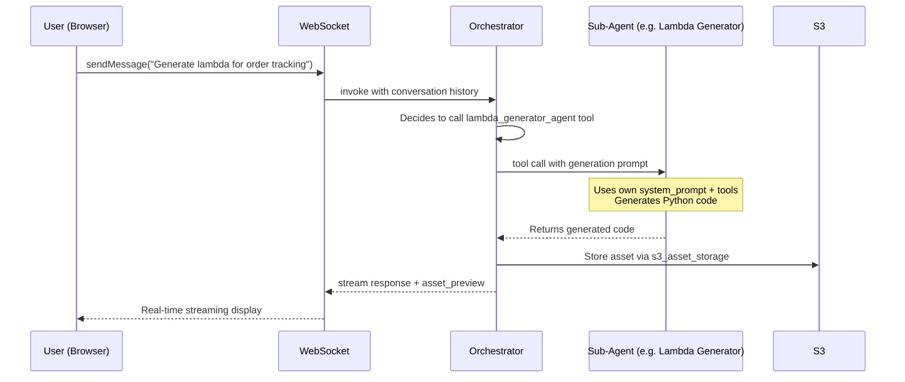

# Architecture / 아키텍처

[English](#english) · [한국어](#한국어)

---

<a id="english"></a>

## Overview

AICC Builder uses a **multi-agent orchestration** pattern where a single Orchestrator agent delegates specialized tasks to 8 sub-agents. The system supports two deployment modes: **Amazon Bedrock AgentCore Runtime** (v1) and **ECS Fargate with S3 Files NFS** (v2), both communicating with the React frontend via WebSocket.

### AgentCore Mode (v1)

```
┌─────────────────────────────────────────────────────────────────────┐
│                        CloudFront + S3                              │
│                     React Web Application                           │
└──────────────────────────┬──────────────────────────────────────────┘
                           │ WebSocket (SigV4 + Cognito)
┌──────────────────────────▼──────────────────────────────────────────┐
│                   AgentCore Runtime (MicroVM)                       │
│  ┌───────────────────────────────────────────────────────────────┐  │
│  │                    Orchestrator Agent                          │  │
│  │  (agentcore/agent.py — Claude Opus, temp=0.7)                │  │
│  │                                                               │  │
│  │  Tools:  introspect_database, save/get/list_operation_spec,  │  │
│  │          merge_infrastructure, merge_openapi,                 │  │
│  │          validate_consistency, replace_asset_field,           │  │
│  │          asset_lookup, stream_fallback_asset                  │  │
│  │                                                               │  │
│  │  Sub-Agents (as tools):                                       │  │
│  │  ┌──────────┐ ┌──────────┐ ┌──────────┐ ┌──────────────────┐│  │
│  │  │Research  │ │FAQ       │ │Lambda    │ │OpenAPI           ││  │
│  │  │Agent     │ │Generator │ │Generator │ │Generator         ││  │
│  │  └──────────┘ └──────────┘ └──────────┘ └──────────────────┘│  │
│  │  ┌──────────┐ ┌──────────┐ ┌──────────┐ ┌──────────────────┐│  │
│  │  │Prompt    │ │Contact   │ │Infra     │ │Reviewer          ││  │
│  │  │Generator │ │Flow Gen  │ │Generator │ │Agent             ││  │
│  │  └──────────┘ └──────────┘ └──────────┘ └──────────────────┘│  │
│  └───────────────────────────────────────────────────────────────┘  │
└────────────┬──────────────┬──────────────┬─────────────────────────┘
             │              │              │
      ┌──────▼──────┐ ┌────▼────┐  ┌──────▼──────┐
      │  DynamoDB    │ │   S3    │  │(ElastiCache)│
      │  (sessions)  │ │ (assets+│  │  (optional) │
      └─────────────┘ │  state) │  └─────────────┘
                       └─────────┘
```

### ECS Fargate Mode (v2)

```
┌─────────────────────────────────────────────────────────────────────┐
│                        CloudFront + S3                              │
│                     React Web Application                           │
└──────────────────────────┬──────────────────────────────────────────┘
                           │ WebSocket (Cognito JWT)
┌──────────────────────────▼──────────────────────────────────────────┐
│                   ALB (idle timeout 4h, sticky sessions)            │
└──────────────────────────┬──────────────────────────────────────────┘
┌──────────────────────────▼──────────────────────────────────────────┐
│                 ECS Fargate (ARM64 Graviton, 2vCPU/4GB)            │
│                 FastAPI + Uvicorn                                    │
│  ┌───────────────────────────────────────────────────────────────┐  │
│  │                    Orchestrator Agent                          │  │
│  │  (ecs/app.py — Claude Opus, temp=0.7)                        │  │
│  │                                                               │  │
│  │  Tools:  (all v1 tools) + workspace file tools:              │  │
│  │          read_workspace_file, write_workspace_file,           │  │
│  │          patch_workspace_file, append_workspace_file,         │  │
│  │          list_workspace_dir, find_workspace_files,            │  │
│  │          grep_workspace                                       │  │
│  │                                                               │  │
│  │  Sub-Agents (as tools): (same 8 sub-agents)                  │  │
│  └───────────────────────────────────────────────────────────────┘  │
│  ┌───────────────────────────────────────────────────────────────┐  │
│  │  /mnt/s3/ (S3 Files NFS Mount)                               │  │
│  │  sessions/{id}/state/    — specs, progress, schemas          │  │
│  │  sessions/{id}/assets/   — generated code, configs           │  │
│  │  sessions/{id}/workspace/— fragments, requirements           │  │
│  │  sessions/{id}/context/  — conversation history              │  │
│  └───────────────────────────────────────────────────────────────┘  │
└────────────┬──────────────┬──────────────┬─────────────────────────┘
             │              │              │
      ┌──────▼──────┐ ┌────▼────┐  ┌──────▼──────┐
      │  DynamoDB    │ │   S3    │  │ CloudWatch  │
      │  (sessions)  │ │ (S3     │  │ (X-Ray,     │
      └─────────────┘ │  Files) │  │  Insights)  │
                       └─────────┘  └─────────────┘
```

**Key differences in v2:**
- Workspace file tools (7 new tools) for direct file read/write/patch/search
- 3-tier session storage: in-memory -> NFS -> DynamoDB metadata
- Graceful shutdown: SIGTERM flushes sessions to NFS before container exit
- Auto-scaling on `ActiveWebSocketConnections` metric (1-10 tasks)
- Frontend File Explorer for real-time workspace browsing

---

## Agent-as-a-Tool Pattern

Each sub-agent is registered as a **tool** on the Orchestrator. When the Orchestrator calls a sub-agent tool, the Strands SDK creates a nested agent invocation with its own system prompt, model config, and tool set.



**Key benefits:**
- Each sub-agent has a specialized system prompt optimized for its domain
- The Orchestrator decides *when* and *which* sub-agent to invoke
- Sub-agents can be called in sequence (e.g., lambda → openapi → infra)
- Agent Pool pre-warms instances to eliminate 200-500ms cold start per call

---

## Agent Pool

The Agent Pool (`src/agents/agent_pool.py`) pre-creates `Agent` instances at startup as singletons, keyed by agent type. Each agent type has its own model configuration:

| Agent | Temperature | Max Tokens | Purpose |
|-------|------------|------------|---------|
| lambda_generator | 0.3 | 128,000 | Deterministic code generation |
| openapi_generator | 0.3 | 128,000 | Structured API spec |
| prompt_generator | 0.5 | 128,000 | Creative but consistent prompts |
| contact_flow_generator | 0.3 | 128,000 | Structured flow definitions |
| infrastructure_generator | 0.3 | 128,000 | Deterministic CDK code |
| interviewer | 0.7 | 4,096 | Conversational, adaptive |

Models are cached by `(temperature, max_tokens)` tuple to avoid recreating identical configurations.

---

## WebSocket Protocol

The frontend connects to AgentCore Runtime via WebSocket at `/ws`. All messages are JSON.

### Client → Server

| Action | Description |
|--------|-------------|
| `sendMessage` | Chat message (with optional `attachments[]`) |
| `uploadQuestionnaire` | Pre-filled questionnaire document |
| `downloadTemplate` | Request questionnaire template |
| `getAssets` | Request generated assets |
| `getProgress` | Request session progress |
| `createSession` | Create new session |
| `restoreSession` | Restore existing session by ID |
| `ping` | Client keepalive |

### Server → Client

| Type | Description |
|------|-------------|
| `stream` | Streaming text chunk from Orchestrator |
| `stream_end` | Stream complete with full response |
| `typing` | Agent is processing |
| `thinking` | Model thinking/reasoning content |
| `tool_start` | Orchestrator tool invocation started |
| `tool_end` | Orchestrator tool invocation completed |
| `tool_input_update` | Streaming tool input (partial) |
| `asset_preview` | Generated asset content (supports delta streaming) |
| `asset_generating` | Asset generation started (status indicator) |
| `asset_complete` | Asset generation finished |
| `download_ready` | Downloadable package URL |
| `subagent_progress` | Sub-agent started/completed |
| `subagent_stream` | Sub-agent streaming text |
| `subagent_tool_use` | Sub-agent internal tool call |
| `subagent_tool_result` | Sub-agent tool result |
| `subagent_error` | Sub-agent error |
| `progress_update` | Progress bar update (auto-mapped from sub-agent) |
| `session_update` | Session state changed |
| `session_created` | New session created |
| `history` | Conversation history for session restore |
| `history_injected` | History injection acknowledged |
| `context_injected` | Context injection acknowledged |
| `error` | Error message (with optional `debug` info) |
| `attachment_error` | File attachment processing error |
| `heartbeat` | Server keepalive |
| `pong` | Response to client ping |

### Delta Streaming for Large Assets

Assets exceeding the 32KB WebSocket frame limit use delta streaming:

```json
{"type": "asset_preview", "assetPreview": {
  "assetType": "lambda",
  "operationId": "track_order",
  "content": "...partial content...",
  "isDelta": true,
  "totalLength": 15000,
  "isComplete": false
}}
```

The frontend accumulates deltas until `isComplete: true`.

### Auto Progress Mapping

Progress updates are sent automatically when sub-agents start/complete, mapped via `SUBAGENT_TO_PROGRESS_ID`:

```
lambda_generator_agent    → "lambda"
openapi_generator_agent   → "openapi"
prompt_generator_agent    → "prompt"
contact_flow_generator_agent → "contact_flow"
infrastructure_generator_agent → "cdk"
faq_generator_agent       → "knowledge_base"
reviewer_agent            → "review"
```

---

## Data Flow

### 1. Conversation Phase

```
User message → WebSocket → Orchestrator
  → Orchestrator decides next action (interview, research, generate)
  → If interview: responds directly with follow-up questions
  → If research: calls research_agent → web search → returns findings
  → Response streamed back via WebSocket
```

### 2. Generation Phase (5 Phases, Each a Separate Turn)

```
Orchestrator decides to generate assets
  → Phase 1: infrastructure_generator_agent (CFn + tables + sample data)
  → Phase 2: lambda_generator_agent (batched, max 6 parallel per turn)
  → Phase 3a: openapi_generator_agent (all operations)
  → Phase 3b: prompt_generator_agent
  → Phase 3c: validate_parameter_consistency (cross-asset validation)
  → Phase 4: contact_flow_generator_agent
  → Phase 5: reviewer_agent (optional, validates all assets)
  → faq_generator_agent (any time during/after generation)
  → Each phase is a separate LLM turn (prevents WS timeout)
  → Assets stored to S3 via s3_asset_storage
  → Asset previews sent to frontend in real-time
```

### 3. Storage Architecture

#### AgentCore Mode (v1)

| Store | Purpose | TTL |
|-------|---------|-----|
| **S3 (Project Workspace)** | OperationSpecs, infrastructure schema, progress, requirements | Permanent |
| **S3 (Assets)** | Generated assets (Lambda code, OpenAPI specs, CDK projects, etc.) | Permanent |
| **AgentCore Memory** | Conversation history persistence (survives MicroVM restarts) | Session lifetime |
| **Redis (ElastiCache)** | Session context cache (optional, disabled by default) | 8 hours |
| **DynamoDB** | Session metadata | Permanent |

#### ECS Fargate Mode (v2) — 3-Tier Session Storage

| Tier | Store | Purpose | TTL |
|------|-------|---------|-----|
| Tier 1 | **In-memory cache** | Hot path — active session context | Process lifetime |
| Tier 2 | **S3 Files NFS** (`/mnt/s3/`) | Persistent state — specs, assets, fragments, conversation history | Permanent |
| Tier 3 | **DynamoDB** | Session metadata (managed by frontend) | Permanent |

The S3FilesContextStore (`s3files_store.py`) manages the 3-tier hierarchy:
- `get_session()` — Tier 1 (memory) with Tier 2 (NFS) fallback
- `save_session()` — Write to Tier 1 + Tier 2 simultaneously
- `append_message()` — Incremental conversation history save to NFS
- Max 60 messages (30 turns) per session

```
assets/{session_id}/
├── state/                          # Project workspace (structured state)
│   ├── project.json                # Company, industry, agent name
│   ├── progress.json               # Phase completion tracking
│   ├── specs/{op_id}.json          # OperationSpec per operation
│   ├── requirements/*.txt          # Large requirement texts
│   └── schemas/infrastructure.json # DynamoDB tables, GSIs, env vars
├── lambda/{op_id}/handler.py       # Generated Lambda handlers
├── openapi/openapi.yaml            # Generated OpenAPI spec
├── prompt/ai_agent_prompt.yaml     # Generated AI agent prompt
├── contact_flow/contact_flow.json  # Generated contact flow
└── infrastructure/template.json    # Generated CloudFormation
```

**Session lifecycle:**
1. Frontend creates session → `session_created` event
2. Conversation stored in AgentCore Memory
3. Structured state (specs, schema, progress) persisted to S3 Project Workspace via `ProjectWorkspace` class
4. Generated assets stored in S3 with session-scoped keys
5. On session restore: `ProjectWorkspace.restore_all()` loads specs/schema/progress from S3, warms in-memory caches, then conversation history injected from frontend

### 4. Session Restore Flow

When a user reconnects to a previously ended session:

```
Frontend sends "injectHistory" with conversation + originalSessionId
  → handle_inject_history_ws()
  → ProjectWorkspace.restore_all() from S3
  → Warm spec_manager._operation_specs + _schema_registry
  → format_history_for_injection() with structured workspace summary
  → Agent receives: [Project State Restored] + [Previous Conversation] + [New Message]
```

### 5. WebSocket Payload Defense

`safe_send_json()` in `agentcore/agent.py` monitors outgoing payload size:

| Threshold | Action |
|-----------|--------|
| **15 KB** | Log `[WS_PAYLOAD_SIZE]` warning |
| **32 KB** | Truncate `content` field proportionally |

Each generation phase runs in a **separate LLM turn** (max ~3 min each) to prevent WebSocket timeout.

### 6. Cross-Asset Validation

`validate_parameter_consistency()` runs after Phase 3b (Prompt), before Contact Flow:

1. Lambda input fields vs OperationSpec `input_fields`
2. Lambda output fields vs OperationSpec `output_fields`
3. OpenAPI request schemas vs OperationSpec (with `$ref` resolution)
4. OpenAPI response schemas vs OperationSpec
5. Infrastructure table keys vs OperationSpec `data_source`
6. Lambda `IndexName=` vs Infrastructure GSI names
7. Lambda `os.environ["X_TABLE_NAME"]` vs Infrastructure `env_var_name`
8. Lambda response structure (data wrapper) vs OpenAPI response schema
9. Operation count: Lambda files == OpenAPI paths == spec count

Mismatches trigger auto-fix via `replace_asset_field` (simple renames) or `modification_request` (re-generation).

---

## Deployment Architecture

### AgentCore Mode

```
┌─────────────────────────────────────────────────────────────┐
│                    CDK Stacks                                │
│                                                              │
│  AiccBuilderStack          RedisStack       KnowledgeBase   │
│  ├─ Cognito User Pool      ├─ VPC           ├─ OpenSearch   │
│  ├─ Cognito Identity Pool  ├─ ElastiCache   └─ Bedrock KB   │
│  ├─ S3 (frontend)          └─ Security                      │
│  ├─ S3 (assets)               Groups                        │
│  ├─ CloudFront                                               │
│  ├─ DynamoDB (sessions)                                      │
│  ├─ DynamoDB (assets)                                        │
│  └─ Lambda (REST API)                                        │
│                                                              │
│  AgentCore Runtime (deployed via CLI, not CDK)               │
│  └─ MicroVM with agent code                                  │
└─────────────────────────────────────────────────────────────┘
```

AgentCore Runtime is deployed separately via `agentcore launch` (called by `deploy.sh`), not through CDK. It provides:
- Up to 8-hour session lifetime (vs Lambda's 15 min)
- MicroVM isolation per session
- Built-in WebSocket support
- Automatic container builds via CodeBuild

### ECS Fargate Mode

```
┌─────────────────────────────────────────────────────────────┐
│                    CDK Stacks                                │
│                                                              │
│  EcsStack                  AiccBuilderStack  KnowledgeBase  │
│  ├─ VPC (2 AZ, NAT)       ├─ Cognito        ├─ OpenSearch  │
│  ├─ ALB (4h idle,sticky)   ├─ S3 (frontend)  └─ Bedrock KB  │
│  ├─ ECS Cluster            ├─ S3 (assets)                   │
│  │  └─ Fargate Service     ├─ CloudFront                    │
│  │     ├─ App container    │  └─ ALB origin (/ws, /invoke)  │
│  │     ├─ X-Ray sidecar   ├─ DynamoDB (sessions)            │
│  │     └─ CW agent         └─ Lambda (REST API)              │
│  ├─ S3 Files (NFS mount)                                    │
│  └─ Auto-scaling (1-10)                                      │
└─────────────────────────────────────────────────────────────┘
```

ECS Fargate mode is deployed entirely via CDK (`./deploy.sh --mode ecs`). Key infrastructure:
- **VPC**: 2 AZs, 1 NAT Gateway, public/private subnets
- **ALB**: Internet-facing, 4-hour idle timeout, sticky sessions for WebSocket
- **Fargate Task**: 2 vCPU, 4GB RAM, ARM64 Graviton, S3 Files NFS volume at `/mnt/s3/`
- **CloudFront**: Routes `/ws` and `/invocations` to ALB origin, static assets to S3
- **Auto-scaling**: Step scaling on `ActiveWebSocketConnections` (1-10 tasks)

---

<a id="한국어"></a>

## 개요

AICC Builder는 **다중 에이전트 오케스트레이션** 패턴을 사용합니다. 하나의 Orchestrator 에이전트가 8개의 전문 서브 에이전트에게 작업을 위임합니다. 시스템은 두 가지 배포 모드를 지원합니다: **Amazon Bedrock AgentCore Runtime** (v1)과 **ECS Fargate + S3 Files NFS** (v2). 두 모드 모두 React 프론트엔드와 WebSocket으로 통신합니다.

**v2(ECS 모드)의 주요 차이:**
- 워크스페이스 파일 도구 7종 추가 (read/write/patch/append/list/find/grep)
- 3-tier 세션 저장소: 메모리 -> NFS -> DynamoDB 메타데이터
- SIGTERM 시 세션을 NFS에 플러시 후 컨테이너 종료
- `ActiveWebSocketConnections` 메트릭 기반 오토스케일링 (1-10 태스크)
- 프론트엔드 파일 탐색기로 실시간 워크스페이스 탐색

---

## Agent-as-a-Tool 패턴

각 서브 에이전트는 Orchestrator의 **tool**로 등록됩니다. Orchestrator가 서브 에이전트 tool을 호출하면, Strands SDK가 해당 에이전트의 고유 system prompt, 모델 설정, tool set으로 중첩 에이전트 호출을 생성합니다.

**핵심 장점:**
- 각 서브 에이전트는 도메인에 최적화된 전용 system prompt 보유
- Orchestrator가 *언제*, *어떤* 서브 에이전트를 호출할지 결정
- 서브 에이전트를 순차 호출 가능 (예: lambda → openapi → infra)
- Agent Pool이 인스턴스를 사전 생성하여 호출당 200-500ms 콜드 스타트 제거

---

## Agent Pool

Agent Pool (`src/agents/agent_pool.py`)은 시작 시 `Agent` 인스턴스를 싱글톤으로 사전 생성합니다. 에이전트 타입별 모델 설정:

| 에이전트 | Temperature | Max Tokens | 용도 |
|---------|------------|------------|------|
| lambda_generator | 0.3 | 128,000 | 결정적 코드 생성 |
| openapi_generator | 0.3 | 128,000 | 구조화된 API 스펙 |
| prompt_generator | 0.5 | 128,000 | 창의적이면서 일관된 프롬프트 |
| contact_flow_generator | 0.3 | 128,000 | 구조화된 플로우 정의 |
| infrastructure_generator | 0.3 | 128,000 | 결정적 CDK 코드 |
| interviewer | 0.7 | 4,096 | 대화형, 적응적 |

---

## WebSocket 프로토콜

프론트엔드는 AgentCore Runtime의 `/ws` 엔드포인트에 WebSocket으로 연결합니다. 모든 메시지는 JSON 형식입니다.

### 클라이언트 → 서버

| Action | 설명 |
|--------|------|
| `sendMessage` | 채팅 메시지 (선택적 `attachments[]` 포함) |
| `uploadQuestionnaire` | 사전 작성된 설문지 문서 |
| `downloadTemplate` | 설문지 템플릿 요청 |
| `getAssets` | 생성된 에셋 요청 |
| `getProgress` | 세션 진행 상황 요청 |
| `createSession` | 새 세션 생성 |
| `restoreSession` | 기존 세션 복원 |
| `ping` | 클라이언트 keepalive |

### 서버 → 클라이언트

| Type | 설명 |
|------|------|
| `stream` | Orchestrator 스트리밍 텍스트 청크 |
| `stream_end` | 스트림 완료 (전체 응답 포함) |
| `asset_preview` | 생성된 에셋 콘텐츠 (델타 스트리밍 지원) |
| `subagent_progress` | 서브 에이전트 시작/완료 |
| `subagent_stream` | 서브 에이전트 스트리밍 텍스트 |
| `progress_update` | 진행률 바 업데이트 (서브 에이전트에서 자동 매핑) |
| `error` | 에러 메시지 (선택적 `debug` 정보 포함) |

전체 메시지 타입 목록은 [영어 섹션](#server--client)을 참조하세요.

### 대용량 에셋 델타 스트리밍

32KB WebSocket 프레임 제한을 초과하는 에셋은 델타 스트리밍을 사용합니다. 프론트엔드는 `isComplete: true`가 올 때까지 델타를 누적합니다.

---

## 데이터 흐름

### 1. 대화 단계

```
사용자 메시지 → WebSocket → Orchestrator
  → Orchestrator가 다음 행동 결정 (인터뷰, 리서치, 생성)
  → 인터뷰: 후속 질문으로 직접 응답
  → 리서치: research_agent 호출 → 웹 검색 → 결과 반환
  → WebSocket을 통해 응답 스트리밍
```

### 2. 생성 단계 (5 Phase, 각각 별도 LLM 턴)

```
Orchestrator가 에셋 생성 결정
  → Phase 1: infrastructure_generator (CFn + 테이블 + 샘플 데이터)
  → Phase 2: lambda_generator (배치, 턴당 최대 6개 병렬)
  → Phase 3a: openapi_generator (전체 오퍼레이션)
  → Phase 3b: prompt_generator
  → Phase 3c: validate_parameter_consistency (교차 검증)
  → Phase 4: contact_flow_generator
  → Phase 5: reviewer_agent (선택, 전체 에셋 검증)
  → faq_generator (생성 중/후 아무 때나)
  → 각 Phase는 별도 LLM 턴 (WS 타임아웃 방지)
  → 에셋은 S3에 저장, 프리뷰는 실시간 전송
```

### 3. 저장소 아키텍처

#### AgentCore 모드 (v1)

| 저장소 | 용도 | TTL |
|--------|------|-----|
| **S3 (프로젝트 워크스페이스)** | OperationSpec, 인프라 스키마, 진행 상태, 요구사항 | 영구 |
| **S3 (에셋)** | 생성된 에셋 (Lambda 코드, OpenAPI 스펙, CDK 프로젝트 등) | 영구 |
| **AgentCore Memory** | 대화 이력 영속화 (MicroVM 재시작 시에도 유지) | 세션 수명 |
| **Redis (ElastiCache)** | 세션 컨텍스트 캐시 (선택, 기본 비활성) | 8시간 |
| **DynamoDB** | 세션 메타데이터 | 영구 |

#### ECS Fargate 모드 (v2) — 3-Tier 세션 저장소

| Tier | 저장소 | 용도 | TTL |
|------|--------|------|-----|
| Tier 1 | **인메모리 캐시** | 핫 경로 — 활성 세션 컨텍스트 | 프로세스 수명 |
| Tier 2 | **S3 Files NFS** (`/mnt/s3/`) | 영속 상태 — 스펙, 에셋, 프래그먼트, 대화 이력 | 영구 |
| Tier 3 | **DynamoDB** | 세션 메타데이터 (프론트엔드 관리) | 영구 |

S3FilesContextStore가 3-tier 계층을 관리합니다:
- `get_session()` — Tier 1(메모리) → Tier 2(NFS) 폴백
- `save_session()` — Tier 1 + Tier 2 동시 기록
- `append_message()` — NFS에 대화 이력 증분 저장
- 세션당 최대 60개 메시지 (30 턴)

**세션 수명주기:**
1. 프론트엔드에서 세션 생성 → `session_created` 이벤트
2. 대화 이력은 AgentCore Memory(v1) 또는 NFS(v2)에 저장
3. 구조적 상태(스펙, 스키마, 진행률)는 S3 프로젝트 워크스페이스에 영속화
4. 에셋은 세션 범위 S3 키로 저장
5. 세션 복원 시: `ProjectWorkspace.restore_all()`이 S3/NFS에서 전체 상태 복구 → 인메모리 캐시 워밍

### 4. WebSocket 페이로드 방어

`safe_send_json()`이 전송 크기를 모니터링합니다:
- **15 KB**: `[WS_PAYLOAD_SIZE]` 경고 로그
- **32 KB**: `content` 필드를 비율적으로 잘라 WS 1006 연결 끊김 방지

### 5. 에셋 간 정합성 검증

`validate_parameter_consistency()`가 Phase 3b (프롬프트) 후, Contact Flow 전에 실행됩니다:
- Lambda/OpenAPI 필드명 vs OperationSpec 입출력 필드
- Lambda GSI 이름 vs 인프라 GSI, 환경변수 vs 인프라 env_var
- Lambda 응답 구조(data wrapper) vs OpenAPI 응답 스키마
- Operation 수 일치 검증 (Lambda == OpenAPI paths == spec count)

---

## 배포 아키텍처

### AgentCore 모드
AgentCore Runtime은 CDK가 아닌 `agentcore launch` (deploy.sh에서 호출)를 통해 별도 배포됩니다:
- 최대 8시간 세션 수명 (Lambda의 15분 대비)
- 세션별 MicroVM 격리
- 내장 WebSocket 지원
- CodeBuild를 통한 자동 컨테이너 빌드

### ECS Fargate 모드
CDK를 통해 전체 배포됩니다 (`./deploy.sh --mode ecs`):
- **VPC**: 2개 AZ, 1 NAT Gateway, 퍼블릭/프라이빗 서브넷
- **ALB**: 4시간 유휴 타임아웃, 스티키 세션 (WebSocket용)
- **Fargate 태스크**: 2 vCPU, 4GB RAM, ARM64 Graviton, `/mnt/s3/` NFS 볼륨
- **CloudFront**: `/ws`, `/invocations`를 ALB 오리진으로, 정적 에셋은 S3로 라우팅
- **오토스케일링**: `ActiveWebSocketConnections` 기반 (1-10 태스크)

CDK 스택 구조에 대한 자세한 내용은 [infrastructure/README.md](../infrastructure/README.md)를 참조하세요.
S3 Files NFS 마운트 아키텍처에 대한 자세한 내용은 [docs/s3-files-nfs-mount-architecture.md](./s3-files-nfs-mount-architecture.md)를 참조하세요.
