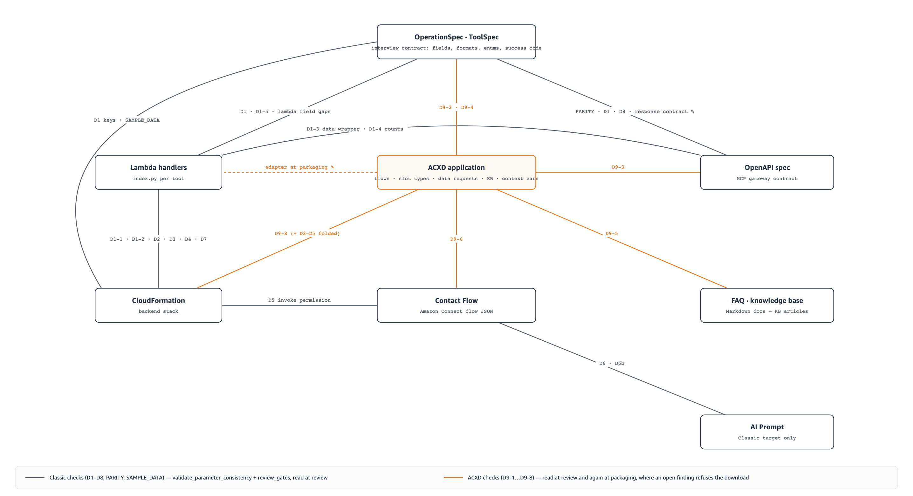

# Validation pipeline — the deterministic gates behind every asset

AICC Builder lets a language model write each asset exactly once. Everything that
happens to the asset after that — normalization, lint, cross-asset comparison, the
review's blocking set, the packaging refusal — is ordinary Python that runs the same
way every time. This document is the map of that code: which checks each asset
passes on its way out, where the assets are compared with one another, and how the
reviewer's judgement and the deterministic gates are combined into one result.

It complements [docs/agentic-ai.md](./agentic-ai.md), which explains *why* the
pipeline is shaped this way (OperationSpec as the contract, patch-only modification).
Here the question is *what runs, where, and what it can do to the asset*.

> Interactive source: [docs/images/validation-gate-map.html](./images/validation-gate-map.html)

## How to read this document

Every deterministic check does one of four things to the asset it looks at. The
tables below use these words consistently:

| Outcome | Meaning |
|---|---|
| **rewrite** | The check changes the asset in place (normalization or auto-fix). The change is recorded in the tool result unless the row says *silent*. |
| **report** | The check adds a finding to the tool result. The orchestrator or the user decides what to do; nothing is blocked. |
| **blocking** | The finding enters the review's blocking set (stable id, counted as `critical_issues`) — or, inside a generator, the step is refused and retried. |
| **refuse** | A hard stop: the interview handoff, a generation call, or the download is refused with a reason. |

And every check runs at one of these moments:

| Stage | Where it lives | Runs when |
|---|---|---|
| **Interview gate** | `tools/interview_completion.py`, `tools/spec_completeness.py` | The interview calls `complete_interview`. |
| **Generation** | `agents/<generator>/agent.py` | The model writes the asset. |
| **Save / merge time** | Inside the same generator (`tools/asset_linters.py`, `tools/merge_*.py`, `tools/response_contract.py`, the ACXD canonicalizer and runtime contract) | Right after the model answers, before the result returns to the orchestrator. |
| **Cross-asset gate** | `tools/validate_consistency.py` (+ `tools/validate_acxd_consistency.py`), `tools/shape_parity.py`, `tools/review_gates.py` | When the orchestrator calls `validate_parameter_consistency`, and inside every review. |
| **Review** | `agents/reviewer_agent/agent.py`, `tools/review_gates.py`, `tools/deterministic_repairs.py` | When the orchestrator calls `reviewer_agent`. |
| **Packaging** | `tools/asset_packager.py`, `tools/acxd_bundle.py`, `tools/acxd_manifest_builder.py` | On download (`GET /api/assets/{session}/download`) or `package_and_upload_assets`. |

All paths below are relative to `backend/ecs/src/`.

## Stage 0 — the interview gate

Generation cannot start until the interview's own exit tool, `complete_interview`,
writes the handoff marker (`context/interview_complete.json`). The tool refuses the
handoff — returning `success: false` and a `problems` list — when any of these fail:

| Gate | Requires | Target |
|---|---|---|
| Spec completeness (`spec_completeness.py`) | Every operation has `output_fields`; every input and output field has a known `field_type`; enum-like types carry `enum_values`; `array` fields have `items`, `object` fields have `properties`. The shared response envelope (`success`, `errorCode`, `message`) is the one thing generation may assume; every other gap must be in the spec. | Classic and ACXD |
| ACXD flow-plan readiness (`acxd_flow_spec.py`) | Every step of every flow plan has been confirmed by the user, the `welcome` / `fallback` / `escalation` roles have one holder each, each operation has a flow plan, strict-format slots are captured by a `user_choice` step, and the application declares at most 10 context variables. | ACXD |
| ACXD plan completeness (`spec_completeness.py`) | Every operation-flow slot maps to a real input field of its OperationSpec; a flow with an `escalate` step has `escalation_conditions`; the application declares `context_variables`. | ACXD |

Until the marker exists, the phase detector keeps the session in `interview` and the
orchestrator's tool list contains no generator (`get_tools_for_phase` in `app.py`).
The handoff happens exactly once per session: the interview history is archived, the
generation prompt takes over, and the marker survives restarts.

The runtime target (Classic or ACXD) is fixed before the first message and drives
both the prompt and the tool list. ACXD swaps `prompt_generator_agent` out and
`generate_acxd_application` / `patch_acxd_asset` / the knowledge-base refresh in.

## Stage 1 — per-asset pipelines

Each generator is a Strands sub-agent. The model's answer is streamed to the
workspace as it arrives (so the UI shows the asset forming) and the deterministic
gates run on the finished text. Where a gate rewrites the asset, the generator
re-streams the corrected version so the stored copy and the preview agree.

### Lambda handlers

`agents/lambda_generator/agent.py` — one handler (`index.py`) per tool id.

| Step | What happens | Outcome |
|---|---|---|
| Load context | ToolSpec + parent OperationSpec, the infrastructure schema (table keys, GSIs, env var names) and the InfrastructureSpec are loaded and rendered into the prompt, including the nested field-schema tree. | — |
| Generate | Model writes the handler; the streamer stores it when the code fence closes. | LLM |
| `lint_lambda_status_codes` (`asset_linters.py`) | A business outcome returned as a 4xx (`create_response(404, …)`, `"statusCode": 4xx`) is rewritten to 200 so the AI agent hears the outcome instead of an HTTP error; 5xx is preserved; a 200 body without an outcome discriminator is warned about. The handler is re-parsed after the rewrite and re-streamed. | rewrite + report |
| `lint_python_source` | `compile()` syntax check, no execution → `syntax_ok`, `syntax_errors`. | report |
| `lambda_field_gaps` (`validate_consistency.py`) | Spec inputs the handler never reads and spec outputs (plus the envelope fields) it never writes — the per-asset preview of the D1 check, so the gap is fixed while the handler is being generated. | report (`spec_field_gaps`) |
| `lint_lambda` (orchestrator tool) | Re-runs the compile check on the stored handler on demand. | report |

The Lambda pipeline reads the spec and the infrastructure schema; it never reads the
OpenAPI document. Lambda ↔ OpenAPI agreement is checked only at the cross-asset gate.

### OpenAPI specification

`agents/openapi_generator/agent.py` — one document for the MCP gateway. Up to six
operations are written in one pass (`mode="full"`); more are written as a base plus
chunks and merged.

| Step | What happens | Outcome |
|---|---|---|
| Load context | All OperationSpecs and tool ids, the infrastructure schema and `api_gateway_config`; a source-of-truth table `operation_id · verb · path` (forcing the `/tools/` prefix) and the nested field-schema tree are injected. | — |
| Generate | Full document, or base + chunks (chunks are stored in a per-session fragment registry mirrored to the workspace). Fragments are **not** linted individually. | LLM |
| `merge_openapi_fragments` (`merge_openapi.py`) | Re-indents fragments to the anchors, de-duplicates paths (by `operationId`) and schemas, and reports chunks that carried paths but no schema block (`chunks_without_schemas`). Missing base or chunks → the merge is refused. | rewrite; report |
| Response-contract projection (`response_contract.py`) | Every operation's request schema becomes exactly the spec's `input_fields`; the success response becomes the shared envelope (`success`, `errorCode`, `message`) plus the spec's `output_fields`, keyed at the spec's `success_status_code`; stray 2xx responses are removed. Generator descriptions and examples are kept; an operation absent from the document is reported, never invented. | rewrite + report (`response_contract_changes`) |
| `lint_and_autofix_openapi` (`asset_linters.py`) | Removes `null`-valued keys, adds a minimal `200` response where none exists, widens `minLength`/`maxLength` to match a fixed-width `pattern` (a live API Gateway validation failure), then validates against the OpenAPI 3.0 schema. Runs after the asset is streamed so the preview is never delayed. | rewrite + report; schema errors are advisory |
| `lint_openapi` (orchestrator tool) | Re-runs the lint on the stored document and saves the fixed copy back. | rewrite + report |

The envelope is declared once (`RESPONSE_ENVELOPE` in `response_contract.py`) and
used by the OpenAPI projection, the ACXD Data Request builder and the Lambda field-gap
check, so the three agree by construction.

### CloudFormation (backend stack)

`agents/infrastructure_generator/agent.py` — a base template plus one fragment per
tool, merged by `merge_infrastructure.py`. The merged template is stored as
`cloudformation/<project>/infrastructure.yaml`.

| Step | What happens | Outcome |
|---|---|---|
| Load context | OperationSpecs, ToolSpecs, InfrastructureSpec (database type, sample rows, customer-lookup switch, test phone number), an `operation_id · method · path · logical ids` table. | — |
| Generate base | Template plus a Schema-Summary JSON (tables, keys, GSIs, env var names) that later gates read as the *infrastructure schema*. | LLM |
| Generate fragments | One `mode="operation"` fragment per tool, seeded with the base's logical ids, generated in parallel. | LLM |
| `merge_infrastructure_fragments` | Inserts fragments at the anchor (falling back to a position before `ApiDeployment` / `Outputs`, reported as *degraded*), then applies thirteen rewrites in a fixed order: hallucinated property names (`RestApiRef` → `RestApiId`, …); CORS response headers declared on every method an integration maps; the invalid `qconnect:` IAM namespace → `wisdom:`; RDS env var names unified on `DB_CLUSTER_ARN` / `DB_SECRET_ARN` / `DB_NAME` (the names the handlers read); an inline `Handler` that names a function the code does not define gets an alias; the `UpdateQSession` role gets the runtime actions it needs (`wisdom:UpdateSessionData`, `connect:DescribeContact`, …) and its env keys; `CustomerLookupFunction` handler name; `cfnresponse` import split; duplicate logical ids and duplicate API Gateway resources removed with references re-pointed; `ApiDeployment.DependsOn` rebuilt from the methods actually present; a trailing `/tools` stripped from the `ApiEndpoint` output; and, for ACXD, `ApiKeyRequired: true` on every non-OPTIONS method. A completeness backstop reports any fragment resource missing from the merged text. | rewrite (logged); report |
| Store + supporting Lambda | The merged template is streamed and stored *before* lint (cfn-lint blocks the event loop); the static `update_q_session` handler is stored as a Lambda asset. | — |
| `lint_and_autofix_cfn` (`asset_linters.py`) | Strips `!Sub` from a string-only `Description`, converts variable-free `!Sub` to plain strings, then runs `cfn-lint`; errors are returned as `lint_errors` for the orchestrator to patch. | rewrite + report; cfn-lint findings are advisory |
| `lint_cloudformation` (orchestrator tool) | Re-runs the `!Sub` fixes, the CORS header rewrite and cfn-lint on the stored template. | rewrite + report |

The merged template is the input of several cross-asset checks (IAM, GSI union, env
var contract, Connect invoke permission, sample data, ACXD backend auth). The
infrastructure generator itself never reads handler code; the Lambda ↔ template
comparison happens at the cross-asset gate.

### Amazon Connect Contact Flow

`agents/contact_flow_generator/agent.py` — the flow JSON that Amazon Connect
imports. The `ContactFlowSpec` (callback, queue transfer, business hours, escalation,
recording) is the behaviour contract; a Bedrock Knowledge Base of verified block
schemas is consulted when `CONTACT_FLOW_KB_ID` is configured. RAG raises the odds of a
correct first draft; import-safety is guaranteed by the linter below, which runs
unconditionally.

| Step | What happens | Outcome |
|---|---|---|
| Generate | Model writes the flow; JSON is extracted from the response (three fallback patterns). | LLM |
| `lint_contact_flow` (`asset_linters.py`) — types | Every block `Type` must be in the allowlist rebuilt from real `CreateContactFlow` probes; known hallucinations are mapped to the real type (`CheckCondition` → `Compare`, `GetUserInput` → `GetParticipantInput`, `TransferToPhoneNumber` → `TransferParticipantToThirdParty`, `CheckStaffing` → `CheckMetricData`, `InvokeAgentAction` → `ConnectParticipantWithLexBot` with parameter rewrite); a type with no mapping is an error. `Trigger` / `EntryPoint` wrappers are removed and `StartAction` re-pointed. | rewrite + report; unknown type → blocking |
| `lint_contact_flow` — parameters | Per-block normalization to the shape the API accepts: recording and analytics behaviour (no `RealTime`, `ChatBehavior` removed, unsupported `AnalyticsLanguage` handled), TTS keys, `FlowLoggingBehavior`, `UpdateContactTargetQueue` string `QueueId`, `TransferContactToQueue` without a queue parameter, Lambda invocation attributes, `CheckHoursOfOperation` True/False branches, `Compare` operands re-homed to `$.Attributes.*` and tool results canonicalized to `Complete` / `Escalate` (eighteen synonyms), Lex V2 alias parameters and exactly one message, `GetParticipantInput` menu vs store mode, `Loop` operands `ContinueLooping` / `DoneLooping`, one prompt source per message block, terminal blocks without transitions, invalid `ErrorType`s removed and required ones injected (including the Agentic CX block's). | rewrite + report |
| `lint_contact_flow` — graph | `StartAction` present and defined; every `NextAction`, error and condition target exists. Unreachable actions and a missing `DisconnectParticipant` are warned about. | blocking (errors); report (warnings) |
| ACXD binding (`acxd_contact_flow_binding.py`) | For the ACXD target: Wisdom session blocks removed, the `ConnectParticipantWithAgenticCX` block built with `WorkspaceId` / `ApplicationId` / `Alias` placeholders and up to 10 context variables, Default / Escalation / Error / Idle-timeout branches wired (generator-authored targets kept when they name real actions), a language block inserted before it, `$.Lex.SessionAttributes.*` rewritten to `$.AgenticCX.ContextVariables.*` only for actions that run after the block, speech the application owns removed, unreachable actions pruned, `Metadata.acxdBinding` written. Idempotent; also re-applied on bundle load. | rewrite (logged) |
| `lint_contact_flow_asset` (orchestrator tool) | Re-runs the linter on the stored flow and reports; it does not write the fixed copy back. | report |

An imported flow (JSON, YAML or a photographed sketch transcribed by the vision
model) goes through the same linter once, is seeded as `imported_flow`, and drops the
session into patch-only mode.

### AI Prompt (Classic target)

`agents/prompt_generator/agent.py` — the Amazon Connect AI Prompt YAML. Generated
alone in its turn, after the OpenAPI document exists, because it must name the same
tool ids.

| Step | What happens | Outcome |
|---|---|---|
| Load context | OperationSpecs, the infrastructure schema, every tool id (operation and session tools), the session flow config (greeting, closing, customer-info variables). | — |
| Generate | Model writes the prompt; the `{{$.toolConfigurationList}}` variable is the single injection point for tool definitions — the prompt guides tools, it does not re-declare them. | LLM |
| `lint_ai_prompt` (`asset_linters.py`) | Every `{{$.x}}` is checked against the variables `CreateAIPrompt` accepts (`toolConfigurationList`, `conversationHistory`, `locale`, `contactId`, `sessionId`, `dateTime`, `instanceId`, `$.Custom.*`); a bare unknown name becomes `{{$.Custom.<name>}}`, a non-identifier expression loses its braces, a variable used twice keeps only its first occurrence. Prevents the live failure where one unknown variable rejected the whole prompt and the deploy finished without an AI agent. | rewrite + report (`unknown_variables`) |
| `ensure_retrieve_tool_guide` | Inserts a language-matched guide for the native RETRIEVE (FAQ) tool unless the spec says `use_native_faq_retrieve: false` — a prompt that named every operation tool but no RETRIEVE guide made the agent refuse a covered FAQ question. | rewrite + report |

The bundle's `deploy.sh` treats a rejected prompt as fatal and prints the offending
variables, so the failure is loud rather than a silent fallback to another agent.

### FAQ and knowledge base

`agents/faq_generator/agent.py` — Markdown FAQ documents, packaged as a knowledge
base ZIP; for ACXD also the knowledge-base articles the application answers from.

| Step | What happens | Outcome |
|---|---|---|
| Source resolution | Research results → explicit parameter → shared context → uploaded documents; with none of these the set is generated as a clearly marked mock starter set, and with no company context at all the call is refused. | refuse / report (`source_mode`) |
| Generate | One document per `save_faq_document` call, rendered into a fixed skeleton (title, question, answer, related information, metadata). The heading shape is load-bearing: the knowledge-base parser and the D9-5 check read exactly these headings. | LLM + rewrite |
| Package | Documents grouped by category, README added, ZIP stored; an empty set is refused. | refuse |
| `refresh_acxd_knowledge_base` (`acxd_application_generator.py`) | ACXD: the knowledge base is rebuilt from the FAQ documents by `build_knowledge_base` and validated against `knowledge_base.schema.json`; articles without a question or an answer are skipped. Exists because the application is assembled before the FAQ phase, so the first knowledge base has no articles until this refresh. | rewrite + report |

### ACXD application (ACXD target)

`agents/acxd_flow_generator/agent.py`, `tools/acxd_*.py`. The application is the
one asset family with two kinds of author: the conversation flows for the operations
are written by the model inside a repair loop, while every other resource — slot
types, Data Requests, secrets, guardrails, knowledge base, context variables, the
system flows (welcome, fallback, follow-up, agent request, escalation, FAQ) and the
application document — is built by code from the interview spec. This is what lets
the system flows behave the same in every project.

**Per-flow generation loop** (`generate_acxd_flows`), one operation at a time:

| Step | What happens | Outcome |
|---|---|---|
| Confirmation gate | The whole call is refused while any plan step is not user-confirmed. | refuse |
| Prompt | The confirmed plan, the business profile, the pinned `flowId`, the declared Data Request ids, the slot-type hint, the system-flow redirect targets and the knowledge-base name are rendered into the prompt. | — |
| Generate | Model writes the flow JSON. An unparseable answer is classified (empty, truncated, prose, …) and retried. | LLM |
| `repair_generated_flow` + `canonicalize_flow` (`acxd_flow_canonicalizer.py`) | Representation is decided by code: messages hoisted onto `node.messages[]`, a slot capture becomes `user_choice` + `metadata.choice{source: slotType}`, `define` becomes `{name, value: Operand}` with chained defines for extra assignments and `increment` / `decrement` for expressions, `contextUpdates` become `stateModifications`, `{{x}}` placeholders become NLX syntax (`{x:NLX.Slot}`, `{x:NLX.Variable}`), context variables compared only with `"true"` / `"false"` become booleans, non-SDK keys are dropped. Unresolvable placeholders and a dropped `maxRetries` are reported. | rewrite + report |
| Runtime contract (`acxd_runtime_contract.py`) | The deterministic port of what a live Connect Customer deployment taught (see [acxd-live-validation.md](./acxd-live-validation.md)). Rule families: **S** slot vocabulary and typing (`text` → `NLX.Text`, one-value custom types → built-in + regex, date/time shapes, `user_choice` naming the slot, capture edges, yes/no constants, slot clearing at exit), **M** messages (placeholders naming real response fields, the silent `generative_text` gets a templated fallback sentence, a message node is only a message, machine codes read aloud are reported), **R** conversation shape (terminal escalate, re-ask recovery, a missed required value before a request, hand back through the follow-up flow instead of ending), **D** data requests (nodes pinned to the planned request, payload carrying every request field, `node_status` routing, response fields and enum values that exist, crossed success branches, `success:false` on HTTP 200), **P** payload reachability per path, **F** a regex-guarded capture with bounded retries, **E** "connect me to an agent" at a capture prompt, **J** generative journeys (`dataCapture` entries, the captured edge, exit conditions, tools and bounds, the read-back sentence), **A** ASCII routing metadata. Most rules rewrite; what cannot be repaired without guessing is reported. | rewrite + report |
| Schema gate (`validate_acxd_flow.py`, `schemas/acxd/flow.schema.json`) | Keys the schema forbids are pruned, then the flow is validated (`flowId` pattern, node types, `additionalProperties: false`, per-type conditions such as a `data_request` node needing `dataRequests`), restricted further to the node subset the pipeline supports. | blocking → retry |
| Stub-bundle consistency (`validate_acxd_consistency.py`) | The flow is validated inside a pseudo-bundle (real Data Requests, real `YesNo` slot type, stubs for sibling flows and custom slot types): graph integrity, undefined slot / Data Request / knowledge-base references, determinism against the confirmed plan, and the cross-scope runtime-contract rules. | blocking → retry |
| Verdict | Any finding is fed back as a correction prompt ("fix only these problems, return the complete flow"); up to five attempts. A flow that never passes is reported as failed and **nothing partial is stored**. | blocking / report |

**Deterministic builders** (`acxd_resource_builders.py`, `acxd_data_request_builder.py`,
`acxd_system_flows.py`, `acxd_application_generator.py`) validate their output
against the JSON schema for the resource (`slot_type`, `data_request`, `guardrail`,
`knowledge_base`, `kb_article`, `context_variable`, `application`) and apply their
own repairs: ASCII-only metadata, project-scoped secret and guardrail names, a
`route` guardrail with no target re-pointed to escalation, a PII mask moved to the
input trigger, an input mask over a value the flows collect kept as `flag`, a
knowledge-base article carrying its FAQ document's whole answer (headings inside the
answer included), a Data Request whose response schema carries types only plus the
`success` flag, both `production` and `development` webhook environments, the
`{<slug>BackendApiKey:NLX.Secret}` header spelling. A system flow that fails its own
gate is treated as a code defect and is not retried.

`generate_acxd_application` refuses to run until the flow plan is ready, generates
the flows first and aborts on any failed flow, then builds the resources in order
and runs the full-bundle consistency check, returning `partial` if anything remains.

**Patch mode** (`patch_acxd_asset`): the target string must occur exactly once; the
patched document is re-canonicalized (flows), re-validated (schema, flow-scope
runtime contract), and the whole bundle is re-checked. Any finding rolls the file
back to its previous content.

## Stage 2 — the cross-asset gate

`validate_parameter_consistency` (`tools/validate_consistency.py`) reads the stored
assets and the specs and returns mismatches. It writes nothing. The orchestrator is
instructed to call it after the prompt phase (Classic) or before the review (ACXD),
and the reviewer calls it again; the review turns every mismatch into a blocking
finding.

> Interactive source: [docs/images/validation-cross-asset-overlap.html](./images/validation-cross-asset-overlap.html)

### Classic checks (D1–D8)

| Id | Assets joined | What must agree |
|---|---|---|
| D1 | spec × Lambda | Every spec input field is read by the handler; every output field (and the envelope) is written. |
| D1 | spec × OpenAPI | Every spec field name appears in the request body / success response (references resolved). |
| D1 | spec × infrastructure schema | The operation's primary key exists in the table's key schema or a GSI. |
| D1-1 | Lambda × infrastructure schema ∪ template | Every `IndexName` a handler queries exists (the union of the schema registry and the template's `GlobalSecondaryIndexes`). |
| D1-2 | Lambda × infrastructure schema | Every `*_TABLE_NAME` environment variable the handler reads is declared. |
| D1-3 | Lambda × OpenAPI | Both use, or both omit, a `data` response wrapper. |
| D1-4 | spec × Lambda × OpenAPI | Handler and path counts cover the operations; the missing ones are named. |
| D1-5 | ToolSpec × Lambda | Tool input fields are read by the tool's handler. |
| D2 | Lambda × CloudFormation | The IAM actions implied by the handler's boto3 / JavaScript SDK v3 calls (`qconnect:` mapped to `wisdom:`) are granted by the function's role. |
| D3 | Lambda × CloudFormation | RDS Data API contract: canonical `DB_*` env var names declared in the template, `includeResultMetadata` passed, no positional row access, no SQL built by string interpolation. |
| D4 | Lambda × scanned database schema | SQL identifiers exist on the table they are used against; `::type` casts name a real type; an `INSERT` supplies every `NOT NULL` column without a default; Data API parameter kinds match column types. |
| D5 | Contact Flow × CloudFormation | Every Lambda the flow invokes has an `AWS::Lambda::Permission` for `connect.amazonaws.com`. |
| D6 | Contact Flow × AI Prompt | Every `$.Lex.SessionAttributes.<name>` the flow reads is set by the prompt (`Tool` is the linter's job); the stored prompt is re-linted for unknown variables (D6b). |
| D7 | CloudFormation | The `update_q_session` function has `CONNECT_INSTANCE_ID` and `AI_ASSISTANT_ID`. |
| D8 | spec × OpenAPI | The spec's `success_status_code` is among the declared responses. |
| SAMPLE_DATA | InfrastructureSpec × CloudFormation | Every value of every customer-supplied sample row appears in the seeder inline code. |

`tools/review_gates.py` adds three families computed alongside:

| Id | What it catches |
|---|---|
| `PARITY:<path>:<reason>` | Spec ↔ OpenAPI **shape** parity (`shape_parity.py`): type map, `items` recursion, exact property sets, enum values in order. Envelope fields are tolerated at the response root only. `oneOf` / `anyOf` / `allOf` and external `$ref` are refused rather than guessed. |
| `SPEC:<asset>:<op>` | An asset (Lambda folder, OpenAPI `operationId`, ACXD Data Request) whose operation has no OperationSpec — nothing else would check it. |
| `MISSING:<asset>:<op>` | An OperationSpec with no Lambda handler, no OpenAPI path, or (ACXD) no Data Request. |

A check whose input asset is absent (no OpenAPI document yet, no template found)
returns no finding for that asset; the `MISSING` gate is what notices an absent asset.

### ACXD checks (D9)

`run_d9_checks` folds the structural engine (`validate_acxd_consistency.py`) and
the asset-joining checks into the same mismatch list. They run only for an ACXD
session.

| Id | Assets joined | What must agree |
|---|---|---|
| D9-1 | ACXD bundle | Per-resource JSON schema; exactly one `start`, a terminal node, node ids matching their keys, no dangling child, a prompt on every generative node, conditions on every `choice`, no empty message, no unreachable node; unique flow / slot type / Data Request / guardrail / knowledge-base ids; application wiring (`defaultFlows` for welcome, fallback, unknown, escalation; guardrail and flow references resolve); settings the service silently drops; the cross-scope runtime-contract rules. |
| D9-2 | ACXD flows × confirmed plan | Every generated flow comes from confirmed steps; every confirmed step has its node (a `basic` message no longer stands in for a confirmed `generative_text`); no unapproved generative node; every planned hand-off has its redirect. |
| D9-3 | ACXD Data Requests × OpenAPI × Lambda | The webhook URL carries `/tools/<operation>` and resolves to a real path; request and response property sets equal the OpenAPI operation's; a live Data Request has a backend to call. |
| D9-4 | ACXD slot types × spec | Enum values, regex, min/max length per FieldSpec; an open value attaches an `NLX.*` built-in (`NLX.Date` / `Time` / `Email` / `Url` / `Number` accepted without a regex) rather than a one-value custom type. |
| D9-5 | ACXD knowledge base × FAQ | A planned knowledge base exists, has articles, and every article and FAQ document carries a question and an answer — parsed with the same function the generator uses. |
| D9-6 | Contact Flow × ACXD application | An Agentic CX block with `Metadata.acxdBinding`; at most 10 context variables, each declared by the application; Default, Escalation, Error and Idle-chat-timeout branches naming real actions; no `$.AgenticCX.*` read before the block; no speech the application owns. |
| D9-7 | ACXD bundle | `flowId` letters-only, node ids UUID-shaped, full locale codes, ASCII-only `description` / `aiDescription`. |
| D9-8 | ACXD Data Requests × CloudFormation | Every non-OPTIONS API method requires an API key and every backend Data Request sends it from an ACXD Secret; the Classic D2–D5 findings are re-raised as blocking because the application depends on that backend. |
| D9-9 | Requirements document × ACXD flows | Every sentence the document quotes for the assistant to say, and the interview kept (not excluded by its `Q` id), is in a generated flow word for word — a message, a journey prompt, or (when the bundle ships one) the Contact Flow. |

### Overlap matrix

R = the check reads the asset. W = the only two paths that write: the
response-contract projection (OpenAPI, at merge time and via the repair tool) and the
ACXD Lambda adapter (handlers, at packaging).

| Check | Spec | Lambda | OpenAPI | CloudFormation | AI Prompt | Contact Flow | FAQ | ACXD app |
|---|---|---|---|---|---|---|---|---|
| D1 (fields, keys, counts) | R | R | R | R | | | | |
| D1-1 GSI · D1-2 env · D2 IAM · D3 RDS · D4 SQL · D7 | | R | | R | | | | |
| D1-3 data wrapper | | R | R | | | | | |
| D5 Connect invoke permission | | | | R | | R | | |
| D6 session attributes · D6b prompt variables | | | | | R | R | | |
| D8 success status code · PARITY | R | | R | | | | | |
| SAMPLE_DATA | R | | | R | | | | |
| response-contract projection | R | | **W** | | | | | |
| D9-1 · D9-7 | | | | | | | | R |
| D9-2 · D9-4 | R | | | | | | | R |
| D9-3 | | R | R | | | | | R |
| D9-5 | | | | | | | R | R |
| D9-6 | | | | | | R | | R |
| D9-8 | | R | | R | | | | R |
| D9-9 | R | | | | | R | | R |
| ACXD Lambda adapter (packaging) | R | **W** | | | | | | R |

## Stage 3 — the reviewer

`reviewer_agent` (`agents/reviewer_agent/agent.py`) is a language-model review with
a deterministic spine.

**What it loads.** The infrastructure schema, the InfrastructureSpec as the
architecture source of truth, and for ACXD the flow spec plus the whole loaded bundle
as authoritative context. Its tools are read-only asset lookups and content reads,
`validate_openapi_schema`, `validate_shape_parity_report`, `check_field_consistency`,
the workspace read/grep tools, `list_operations` / `get_operation_spec`, and
`validate_parameter_consistency`.

**What it judges.** Completeness; OpenAPI and YAML quality; Lambda code; cross-asset
field tracing, nested shape and enum fidelity, path spelling; CloudFormation; sample
data and GSI nulls; Contact Flow behaviour against the requested behaviours; native
capabilities that must not have become Lambdas (FAQ retrieval, escalation, end call);
a cross-check of the lint gates; the prompt template. For ACXD: determinism against
the confirmed plan (including the generative-journey `dataCapture` and captured-edge
rules), guardrail coverage, knowledge-base coverage, escalation wiring to the
Agentic CX `Escalation` branch, the Data Request contract, metadata constraints. Its
`❌` and `⚠️` lines are counted by finding line (bullets or numbered items, not raw
markers) and reported as `advisory_critical` and `warnings`.

**What blocks.** After the model finishes, `collect_blocking_findings`
(`tools/review_gates.py`) recomputes the blocking set in code from four collectors,
each isolated so one failure cannot erase the others:

| Gate | Id shape | Source |
|---|---|---|
| `consistency` | `D:<asset>:<operation>:<field>:<issue>` | D1–D8 and SAMPLE_DATA |
| `acxd-d9` | `D9-x:<asset>:<operation>:<field>:<code>` | D9-1 … D9-9 |
| `parity` | `PARITY:<path>:<reason>` · `PARITY:<op>:refused` · `PARITY:openapi:unparsable` | `shape_parity.py` |
| `spec` | `SPEC:<asset>:<op>` · `MISSING:<asset>:<op>` | orphan asset / spec without asset |

A gate that cannot run is itself a blocking finding (`GATE:consistency:unavailable`).
The ids are stable across runs, so they can be diffed: the previous review's ids are
stored in `context/review_blocking.json`, and the result reports `fixed`, `new` and
`remaining`. `critical_issues` **is the count of this set**, never the model's own
tally — a list that changes on every run cannot be the exit condition of a fix loop.
The report itself is stored at `assets/review/latest/review_report.md`, so the
orchestrator can re-read it instead of re-running the review.

**The fix loop.** The orchestrator relays findings verbatim and never fixes on its
own: the user chooses. Repairs run in a fixed order of preference:

1. **Deterministic repairs** (`tools/deterministic_repairs.py`), which resolve whole
   families without a model: `enforce_openapi_contract_tool` re-projects the OpenAPI
   document from the specs (clears `PARITY:*` by construction);
   `rebuild_acxd_slot_types_tool` re-derives the custom slot types and Data Requests
   from the confirmed plans and FieldSpecs (D9-3, D9-4) and reports what the gate
   still sees afterwards; `remove_duplicate_asset_copies_tool` deletes a byte-identical
   duplicate ACXD document (D9-1 `DUP_*`).
2. **Patch-only modification.** A generator called with a `modification_request`
   receives `read_current_file` / `patch_file` tools and must use them; one that
   regenerates or answers in prose is failed with `modification_did_not_patch`. A
   sub-agent that believes the spec itself is wrong escalates (`spec_level`) instead,
   and the spec is changed with `update_operation_spec` on the user's approval.
3. **Focused re-review** with `focus_items` naming the previous issues, capped at one
   fix cycle before remaining findings are handed back to the user.

## Stage 4 — packaging

`package_assets_impl` (`tools/asset_packager.py`) serves both targets; the download
endpoint restores the session's specs before it runs and returns a refusal as
HTTP 409 with the problem list.

**Classic** zips the stored assets, adds the README and `deploy.sh`, and refuses only
when there is no bucket or nothing to package. Review findings do not block a Classic
download; the review result tells the user what is open.

**ACXD** loads the bundle through `load_acxd_bundle` (`tools/acxd_bundle.py`), which
re-normalizes on every load because assets are patched after generation and because
later contract fixes must reach bundles generated earlier: flows are re-canonicalized
and their knowledge-base node repaired, a slot bound to a slot type no longer in the
bundle is rebound to the per-field type of the same name, slot types no flow attaches
and guardrails or secrets nothing references are dropped, the Data Request secret
syntax and environments are repaired, duplicate identical documents collapse, and the
Contact Flow is re-linted and its binding refreshed. The packager then runs the
runtime-contract pass over the operation flows, builds the deploy manifest, and
**refuses the download** on any D9 finding, any deploy-manifest schema or coverage
problem, a manifest entry with no matching file, a duplicate archive path with
differing content, or a missing runner file. Lambda handlers get the ACXD boundary
adapter injected (separator-less slot values restored, request and response types
coerced, 201/202/204 folded to 200, a missing `success` flag derived). Secrets are
emitted as name and `valueEnv` only — a value can never reach the ZIP.

The bundle's Node runner re-validates the manifest, pre-flights every guardrail file
and refuses unresolved placeholders before it writes anything to the workspace.

## What is enforced, and where

The tables above describe checks; this one describes consequences.

| Situation | Effect |
|---|---|
| Spec incomplete, ACXD plan unconfirmed | `complete_interview` refuses; no generator tool is available. |
| ACXD flow fails its save gate five times | Nothing is stored for that flow; the application generation aborts. |
| A `modification_request` sub-agent does not patch | The call fails; the asset is untouched. |
| An ACXD patch introduces a finding | The file is rolled back. |
| Blocking findings open at review | `critical_issues > 0`; the user is asked which to fix. **Only the ACXD download is refused** while D9 findings remain; a Classic download proceeds with the review result as the record. |
| ACXD deploy manifest inconsistent with the bundle | Download refused (HTTP 409). |
| Lint errors after merge (cfn-lint, OpenAPI schema) | Reported to the orchestrator, which is instructed to patch and re-lint; not enforced by code. |
| An asset is patched after generation | The generator's save-time gates do **not** re-run on the patched text (the patch tools write the file directly). The patched asset is next checked by the cross-asset gate and the review — and, for ACXD, by the bundle-load normalization and the packaging gate. `lint_lambda`, `lint_openapi`, `lint_cloudformation` and `lint_contact_flow_asset` exist so the orchestrator can re-check a patched asset on demand. |
| A check's input asset is missing | The check is skipped silently; `MISSING:*` reports the absent asset. |

## Source map

| Concern | Module |
|---|---|
| Interview exit gates | `tools/interview_completion.py`, `tools/spec_completeness.py`, `tools/acxd_flow_spec.py` (plan readiness) |
| Per-asset lint and normalization | `tools/asset_linters.py` (Lambda status codes and compile check, OpenAPI lint, cfn-lint wrapper, Contact Flow linter, AI Prompt lint) |
| Merges | `tools/merge_openapi.py`, `tools/merge_infrastructure.py` |
| Shared response envelope | `tools/response_contract.py` |
| Spec ↔ OpenAPI shape parity | `tools/shape_parity.py` |
| Cross-asset gate | `tools/validate_consistency.py` (D1–D8, SAMPLE_DATA, D9 orchestration), `tools/validate_acxd_consistency.py` (ACXD structural engine) |
| Blocking set and ids | `tools/review_gates.py` |
| Deterministic repairs | `tools/deterministic_repairs.py` |
| Reviewer | `agents/reviewer_agent/agent.py`, `agents/reviewer_agent/system_prompt.py` |
| ACXD representation and runtime behaviour | `tools/acxd_flow_canonicalizer.py`, `tools/acxd_runtime_contract.py`, `tools/validate_acxd_flow.py`, `schemas/acxd/*.schema.json` |
| ACXD builders | `tools/acxd_resource_builders.py`, `tools/acxd_data_request_builder.py`, `tools/acxd_system_flows.py`, `tools/acxd_application_generator.py`, `tools/acxd_generation_context.py` |
| ACXD Contact Flow binding | `tools/acxd_contact_flow_binding.py` |
| ACXD patching | `tools/acxd_asset_patcher.py` |
| Packaging and bundle load | `tools/asset_packager.py`, `tools/acxd_bundle.py`, `tools/acxd_manifest_builder.py`, `tools/acxd_lambda_adapter.py` |
| Tool-claim audit (a turn that narrates a gate it never ran) | `tools/tool_claim_audit.py` |
